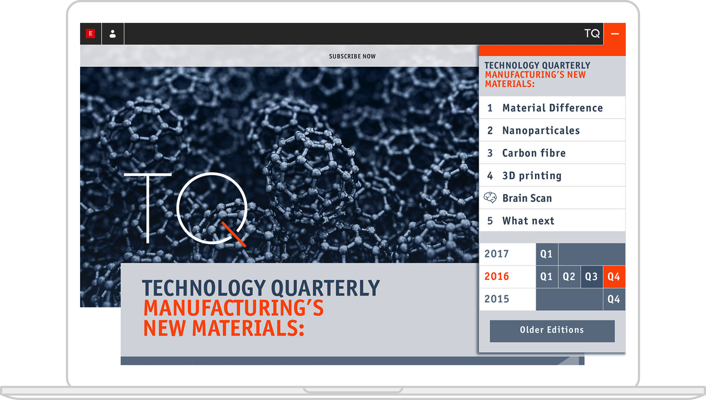
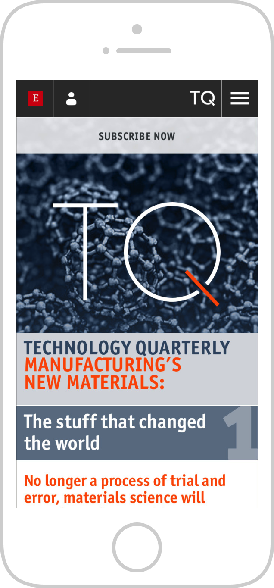
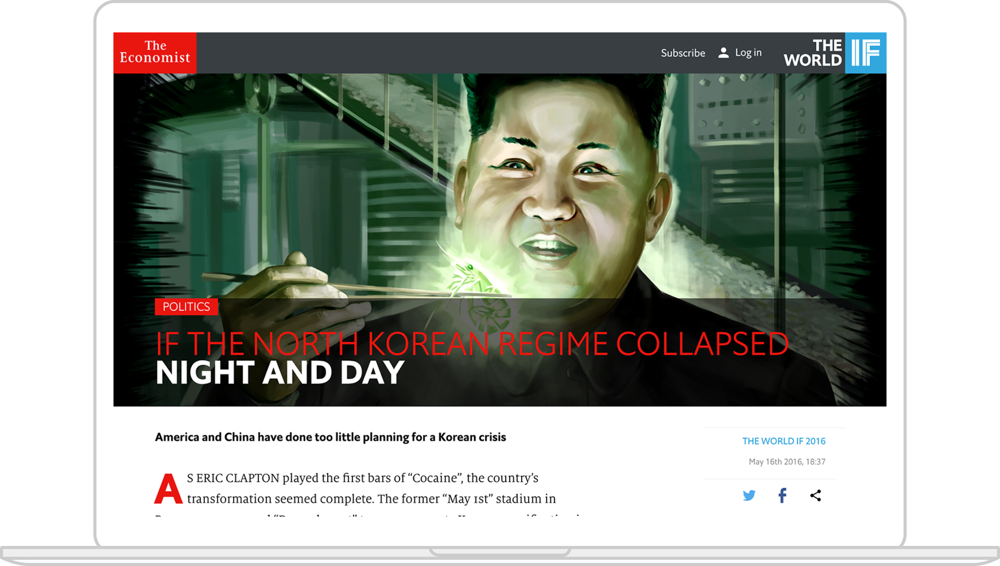
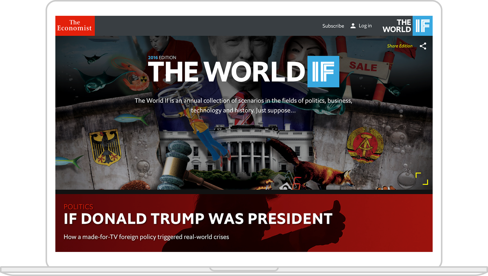
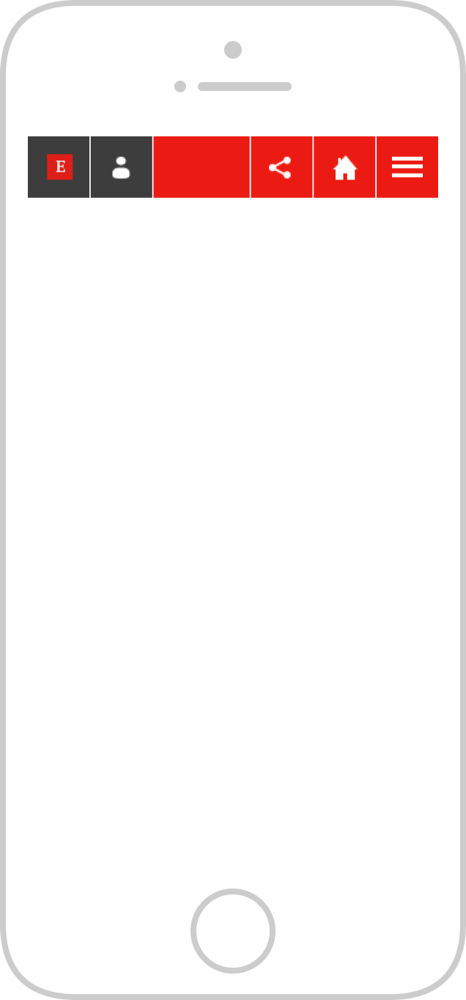

Working as part of a cross functional team designing for the master brand including ‘The World If’ (both the 2015 and 2016 editions) and ‘Technology Quarterly’ sub brands, and its sister publication The World In. Working closely with other designers, UX and developers to iterate on design concepts to ensure fully responsive solutions to briefs set by both the Creative Digital Art Director and editorial were realised. Designing social media templates, working with the New York City office to ensure The Economist’s presence on ‘Facebook Instant Articles’ was on brand, and helping to create a more immersive experience for readers of The Economist’s ‘Essays’ and it’s other long form content.

  

  

  
  
  
  
  
  
  
