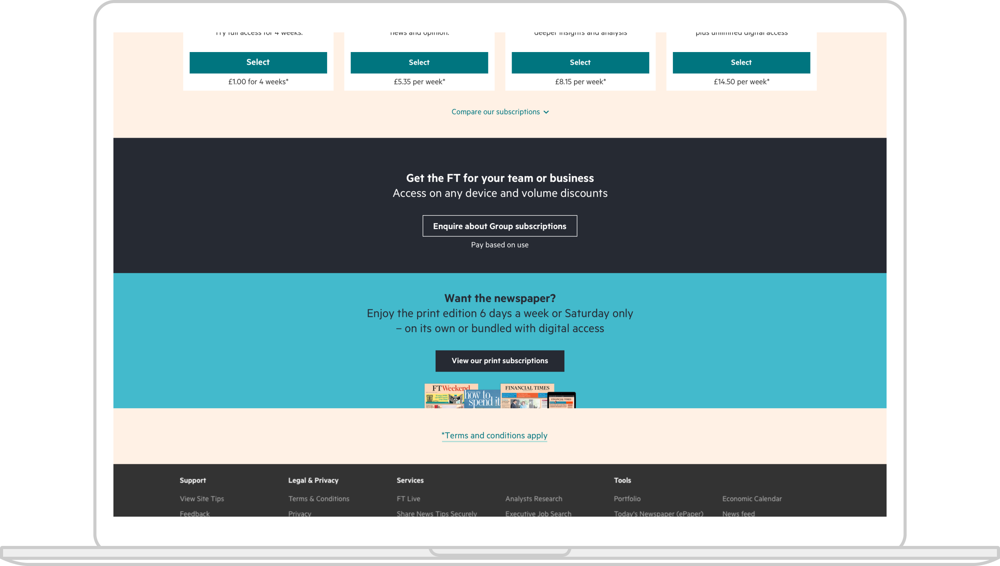
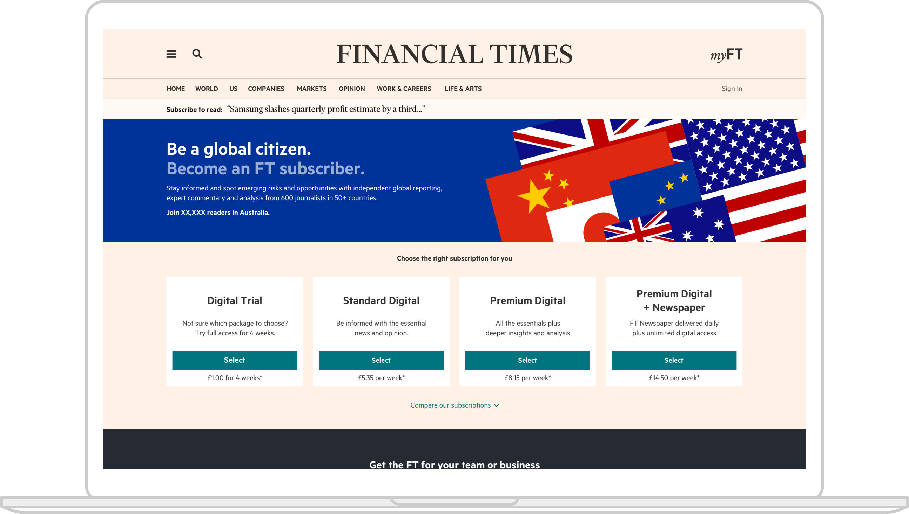
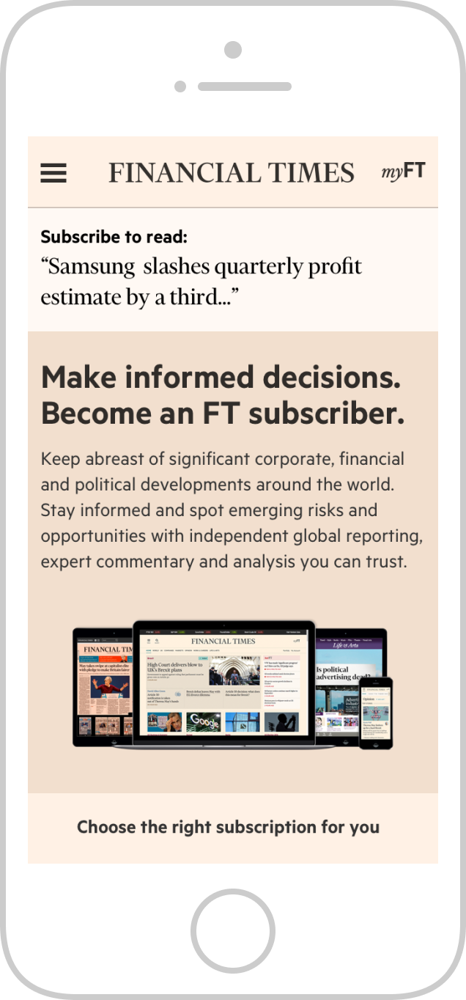

Working across several streams within Product & Technology, including Acquisition and GPDR. Working closely with developers, product owners, the legal team and stakeholders to successfully meet a number of briefs. For GDPR I worked on a number of initiatives to help the FT become compliant while ensuring any new controls and pages required were concise and fully accessible. Throughout my time at the FT I worked very closely with the Origami team to define and maintain a component library for use by both internal and external products, including FT.com and the Apps. Most recently, I was defining a new design system and exploring how we encourage more designers and developers to use the libraries, while also considering core experience and championing accessibility.

  

  

  

  

  

  

  

  

  
